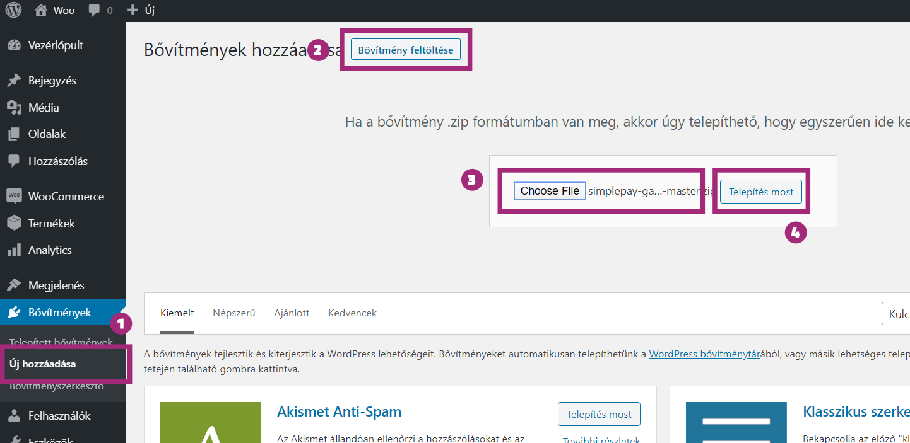
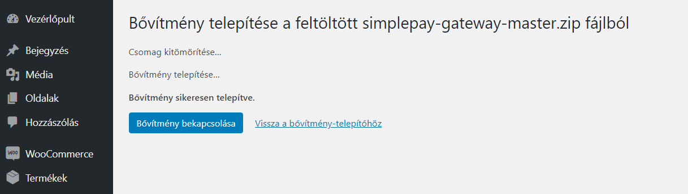
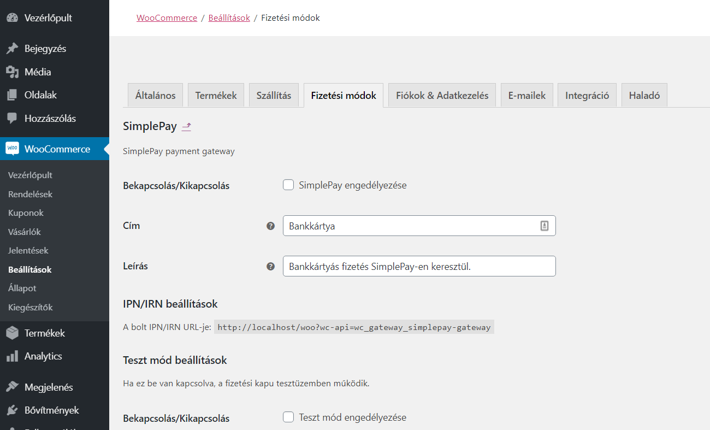

__A SimpePay bővítményt manuálisan tudjuk telepíteni, ami szerencsére WordPress-ben nem nagy kihívás. Annyit kell tennünk, hogy letöltjük a bővítményt, majd feltöltéssel telepítjük a kiválasztott WordPress oldalra.__

Fontos, hogy mindig legyen biztonsági mentésed és hogy lehetőleg naprakész WordPress verzióra telepítsd a bővítményünket.

## 1. A bővítmény letöltése

Első lépéként töltsük le a bővítmény forrását. Ezt megtehetjük közvetlenül a fenti menü letöltés gombjára kattintva.

## 2. Feltöltés, telepítés

Ha a letöltéses telepítést választjuk, akkor keressük meg a letöltött .zip fájlt és töltsük fel a kiszemelt WordPress példányba.

1. Navigáljunk a __Bővítmények / Új hozzáadása__ menüpontra.
2. Kattintsunk felül a címsorban található __Bővítmény feltöltése__ gombra.
3. Az újonnan kinyílt szekcióban kattintsunk a __fájl kiválasztására__, majd tallózzuk be a korábban letöltött fájld.
4. Kattinsunk a __Telepítés most__ gombra.

## 3. Aktiváljuk a bővítményt

A feltöltés után kapunk egy képernyőt, ahol láthatjuk, hogy a bővítményt sikeresen telepítettük. Ez csupán egy egyszerű oldal, ahol a telepítés folyamatait tudjuk végigkisérni.

Ahogy ezen a képernyőn láthatod, egyből tudod is aktiválni. Kattints a __Bővítmény bekapcsolása__ gombra és már fut is a SimplePay WooCommerce bővítményed.

Ha elmulasztanád az aktiválást ezen az oldalon, akkor a __Bővítmények / Telepített bővítmények__ menüpont alatt mindig tudod aktiválni.

## 4. A SimplePay bővítmény beállításai

Aktiválás után a bővítmény beállításait a __WooCommerce / Beállítások / Fizetési módok / SimplePay__ menü alatt találod meg.

