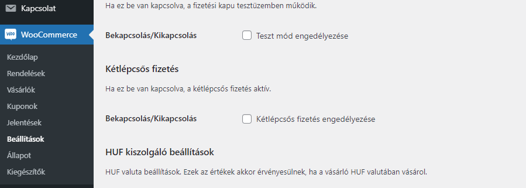

__SimplePay-en keresztül lehetőség van kétlépcsős fizetési megoldás alkalmazására is, amit már bővítményünk is támogat.__

## Pontosan mit jelent a kétlépcsős fizetés?

Egylépcsős fizetés esetében, a kártyaadatok megadása után, a SimplePay azonnal levonja a kártyáról az összeget. A legtöbb esetben ez az eljárás tökéletesen elég.

Azonban lehetnek esetek, amikor a rendelés végleges összege csak később derül ki, tehát a rendelés leadása és a fizetés után. Ebben az esetben lehetőségünk van kétlépsős tranzakciókat indítani, amely a kártyaadatok megadása után, nem levonja, hanem csak befoglalja (előfoglalja) az adott összeget, majd második lépésként, amikor a kereskedő pontosan tudja a rendelés összegét, egy API kérés (manuálisan küldve a WooCommerce rendelések oldaláról) segítségével levonhatja a lefoglalt összeget.

A dokumentációban leírtak szerint __3 féle összeg adható meg__ a második lépésben:

- A teljes befoglalt összeg: ekkor az eredetileg befoglalt összeg terhelődik,
- A teljes összegnél kisebb, de nullánál nagyobb összeg: ekkor az itt megadott összeg terhelődik, a fennmaradó pedig felszabadul a vásárló kártyáján,
- Nulla érték: ekkor a teljes befoglalt összeg felszabadul a vásárló kártyáján.

> A 2.5.0 verziótól támogatjuk a kétlépcsős fizetést.

__Tehát a második lépésben többet nem lehet levonni mint az eredetileg befoglalt összeg.__

## A kétlépcsős fizetés engedélyezése

A következő két lépés szükséges a kétlépcsős fizetés bekapcsolásához:

1. A SimplePay munkatársainak manuálisan kell engedélyezni a sandbox rendszerben.
2. A bővítmény beállításoknál (WooCommerce / Beállítások / Fizetési módok) / SimplePay) kapcsolhatjuk be a kétlépcsős fizetést.



> __Figyelem:__ ennek bekapcsolásakor minden SimplePay tranzakció kétlépcsőssé válik.

## Csak bizonyos rendeléseknél szeretném be- vagy kikapcsolni a kétpécsős fizetést. Hogyan tehetem meg?

Mivel elpfordulhat, hogy csupán bizonyos termékeknél szeretnénk bekapcsolni ezt a funkciót, ezért implementáltunk egy WordPress filtert, amivel pontosan, feltételhez kötve kezelhetjük (hogy mikor akarunk kétlépcsős fizetést):

```php
add_filter('cone_simplepay_enable_two_step_payment', function ($enabled, $order) {
    if ($order->someCondition()) {
        return ! $enabled;
    }

    return $enabled;
}, 10, 2);
```

A feltétleben (if) határozzuk meg a nekünk megfelelő terméket, termék kategóriát, vagy bármi mást a (natív WP segéd függvényekkel).

## A második lépcső indítása

A második lécspcső, azaz a befoglalt összeg teljes- vagy valamekkora részének terhelése, csak __manuálisan indítható a rendelés admin felületén__.

> Amennyiben az újraszámolt rendelés összege **nagyobb** mint a befoglalt összeg, hogy ne fusson hibára a kérés, a befoglalt összeg kerül átadásra.

A "Rendelés műveletek" doboz alatt elérhető egy új opció, amelynek lefuttatásával indíthatjuk az API kérés a SimplePay felé. Ezt követően a SimplePay,  IPN-t küld a webáruház részére, hasonlóan az egylépcsős megoldáshoz.


