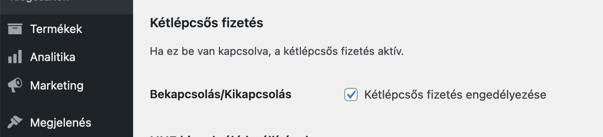
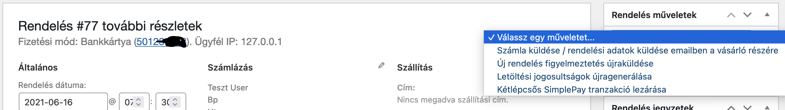

__A kétlépcsős fizetést a SimplePay munkatársainak manuálisan kell engedélyezni a sandbox rendszerben.__

## Pontosan mi a kétlépcsős fizetés?

Egylépcsős fizetés esetében, a kártyaadatok megadása után, a SimplePay azonnal levonja a kártyáról az összeget. A legtöbb esetben ez az eljárás tökéletesen elég.

Azonban lehetnek esetek, amikor a rendelés végleges összege csak később derül ki, tehát a rendelés leadása és a fizetés után. Ebben az esetben lehetőségünk van kétlépsős tranzakciókat indítani, amely a kártyaadatok megadása után, nem levonja, hanem csak befoglalja az adott összeget, majd második lépésként, amikor a kereskedő pontosan tudja a rendelés összegét, egy API kérés segítségével levonhatja a lefoglalt összeget.

A dokumentációban leírtak szerint 3 féle összeg adható meg a második lépésben:

- A teljes befoglalt összeg: ekkor az eredetileg befoglalt összeg terhelődik,
- A teljes összegnél kisebb, de nullánál nagyobb összeg: ekkor az itt megadott összeg terhelődik, a fennmaradó pedig felszabadul a vásárló kártyáján,
- Nulla érték: ekkor a teljes befoglalt összeg felszabadul a vásárló kártyáján.

Tehát a második lépésben többet nem lehet levonni mint a befoglalt összeg.

## A kétlépcsős fizetés engedélyezése a bővítményben

A bővítmény beállításoknál kapcsolhatjuk be a kétlépcsős fizetést.



> Figyelem: ennek bekapcsolásakor minden SimplePay tranzakció kétlépcsőssé válik.

## Csak bizonyos rendeléseknél szeretném be- vagy kikapcsolni a kétpécsős fizetést. Hogyan tehetem meg?

Mivel ez is előfordulhat, így ennek kiküszöbölésére egy WordPress filtert alkalmazunk:

```php
add_filter('cone_simplepay_enable_two_step_payment', function ($enabled, $order) {
    if ($order->someCondition()) {
        return ! $enabled;
    }

    return $enabled;
}, 10, 2);
```

## A második lépcső indítása

A második lécspcső, azaz a befoglalt összeg teljes- vagy valamekkora részének terhelése, csak manuálisan indítható a rendelés admin felületén.

> Amennyiben az újraszámolt rendelés összege **nagyobb** mint a befoglalt összeg, hogy ne fusson hibára a kérés, a befoglalt összeg átadásra.

A "Rendelés műveletek" doboz alatt elérhető egy új opció, amelynek lefuttatásával indíthatjuk az API kérés a SimplePay felé. Ezt követően, ugyan úgy IPN-t küld a SimplePay rendszere a webáruház részére, hasonlóan az egylépcsős megoldáshoz.


