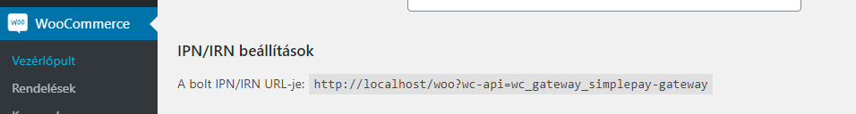
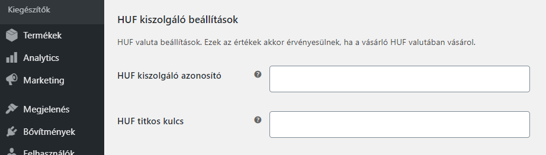

__A bővítmény beállítása a legtöbb esetben magától értetődő. WooCommerce fizetési kapu esetén az adott megoldás bonyolultságát többnyire a fizetési szolgáltató határozza meg.__

A SimplePay bővítmény beállításait a WooCommerce / Beállítások / Fizetési módok / SimplePay útvonalon érjük el.

A kiegészítő beállításához kétoldali kapcsolat szükséges. Tehát azonosítanunk kell a SimplePay szolgáltatását a WordPress oldalunkon belül, valamint a SimplePay-el is tudatnunk kell, hogy hogyan tud kommunikálni az oldalunkkal. Ezt egyrészt a IPN/IRN URL-el, másrészt a kereskedői azonosító és a titkosító kulccsal tehetjük meg (lást lent).

## Éles és teszt üzem 

Mint a legtöbb fizetési megoldás esetén, úgy itt is van lehetőség tesztelni a fizetést úgynevezett sandbox módban. Csak a megfelelő teszt után állítsuk be az éles adatokat. A teszt módot a “Teszt mód” címsor alatti jelölőnégyzettel tudjuk be/ki kapcsolni.

A [teszt](https://sandbox.simplepay.hu/admin/login) és az [éles](https://admin.simplepay.hu/admin/login) adatok a SimplePay adminisztrációs felületén érhetőek el. Az érvényes szerződés megkötését követően, a SimplePay hozzáférést biztosít a felületekhez.

Az éles beállítások azt követően lesznek elérhetőek, hogy a SimplePay munkatársai ellenőrizték az integrációt tesztüzemben és megfelelőnek a működését. Az éles adatok beállítása teljesen ugyanaz, mint a teszt adatoké.

*Figyeljünk arra is, hogy a WordPress ökoszisztémája hatalmas, amiből akadhat konfliktus helyileg, akárcsak a frissítésekből. Egy-egy újabb bővítmény verziót (vagy WordPress frissítést) elsőként csak átmeneti (staging) szerveren próbáljunk ki.*

## IPN/IRN URL

Az áruház és a SimplePay kommunikációját a megfelelő URL (IPN/IRN) beállítással biztosíthatjuk a SimplePay adminisztrációs felületén. Az URL automatikusan generálásra kerül a WooCommerce (WordPress) fizetési beállításoknál, a SimplePay fül alatt (IPN/IRN beállítások címsor).

*Ügyeljünk, hogy a kimásolt adatok pontosak legyenek, ne tartalmazzanak extra szóközöket.*

## Kiszolgáló beállítások

A SimplePay adminisztrációs felületén elérhető a kereskedői azonosító (*MERCHANT*) és a titkosító kulcs (*SECRET_KEY*). Ezeket az adatokat kell megadni a WooCommerce (WordPress) felületén a fizetési beállításoknál, a SimplePay fül alatt.

Több kereskedői fiók esetén, a megfelelő devizanemet figyelembe véve kell az adatokat kitölteni. A három támogatott deviza (*HUF*, *EUR*, *USD*) mezőit egymás alatt találjuk. Attól függően, hogy teszt, vagy éles adatokat kívánunk megadni, kapcsoljuk ki, vagy be a teszt módot.

## Visszatérítések

Visszatérítés a WooCommerce (WordPress) és az OTP SimplePay oldaláról is kezdeményezhető. WooCommerce-en belül navigáljunk a visszatérítendő rendelés adminisztrációs oldalára (WooCommerce / Rendelések / …), majd a tétel panel alján kattintsunk a “Visszatérítés” gombra.

## Korlátozások

Az alább felsorolt korlátozásokat kérünk vedd figyelembe.

### Támogatott devizák

Jelenleg (a SimplePay által) támogatott devizák: __HUF__, __EUR__ és __USD__.

### Adók

A WooCommerce (WordPress) máshogy kezeli az adókat mint a SimplePay. A lehetséges áreltérések megelőzése érdekében, a bruttó árak kerülnek átadása, de a feltüntetett adó mértéke 0.

### Kedvezmények

A WooCommerce (WordPress) máshogy kezeli a kedvezményeket mint a SimplePay. A lehetséges áreltérések megelőzése érdekében, a kedvezményes árak kerülnek átadása, de a feltüntetett kedvezmény mértéke 0.

### Ismétlődő fizetések

Jelenleg nem támogatjuk az ismétlődő fizetéseket. Miért? Mert a tranzakciók indítása, ütemezése és kezelése az áruházat terhelik. Ennek üzembiztos megvalósítása sok áruház esetében nem garantált.

